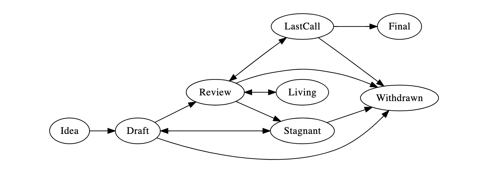

## What is a CIP?

CIP stands for Cartesi Improvement Proposal. A CIP is a design document providing information to the Cartesi community, or describing a new feature for Cartesi or its processes or environment. The CIP should provide a concise technical specification of the feature and a rationale for the feature. The CIP author is responsible for building consensus within the community and documenting dissenting opinions.

## CIP Rationale

We intend CIPs to be the primary mechanism for proposing new features, for collecting community technical input on an issue, and for documenting the design decisions that have gone into Cartesi. Because the CIPs are maintained as text files in a versioned repository, their revision history is the historical record of the feature proposal.

For Cartesi implementers, CIPs are a convenient way to track the progress of their implementation. Ideally each implementation maintainer would list the CIPs that they have implemented. This will give end users a convenient way to know the current status of a given implementation or library.

## CIP Types

There are four types of CIP:

- A **Core CIP** describes any change that affects the Cartesi implementation or any change or addition that affects the interoperability of applications using Cartesi, or the Cartesi ecosystem’s user experience.

- An **Application CIP** describes programmatic and operation standards for the application layer. Those include methodologies, best practices, conventions and interfaces that applications built on Cartesi can choose to conform to.

- A **Meta CIP** describes a process surrounding Cartesi or proposes a change to (or an event in) a process. Examples include procedures, guidelines, changes to the decision-making process, and changes to the tools or environment used in Cartesi development.

- An **Informational CIP** describes a Cartesi design issue, or provides general guidelines or information to the Cartesi community. Informational CIPs do not necessarily represent Cartesi community consensus or a recommendation.

A CIP must meet certain minimum criteria. It must be a clear and complete description of the proposed enhancement. The enhancement must represent a net improvement. The proposed implementation, if applicable, must be solid and must not unduly complicate the system.

## CIP Workflow

### Shepherding a CIP

Parties involved in the process are you, the champion or *CIP author*, the *CIP editors* and the *Cartesi Core Developers*.

Before you begin writing a formal CIP, you must vet your idea. You must start a discussion by filing an issue on [the Cartesi Governance repository] in order to ask the Cartesi community for feedback. Once a CIP discussion is created, it will be announced on several of Cartesi’s social media channels to invite the community to participate. Prior to starting a formal discussion on the Cartesi Governance repository, you can also carry out preliminary discussions on other Cartesi social media channels or on any other forum.

Once the idea has been vetted, your next responsibility will be to present (by means of a CIP) the idea to the reviewers and all interested parties, invite editors, developers, and the community to give further feedback. You should try and gauge whether the interest in your CIP is commensurate with both the work involved in implementing it and how many parties will have to conform to it. For example, the work required for implementing a Core CIP will be much greater than for an Application CIP and the CIP will need sufficient interest from Cartesi implementers. Negative community feedback will be taken into consideration and may prevent your CIP from moving past the Draft stage.

### Core CIPs

Core CIPs require a complete implementation to be considered **Final**.

### CIP Process 

The following is the standardization process for all CIPs in all tracks:

**Idea** - An idea that is pre-draft. This is not tracked within the CIP Repository.

**Draft** - The first formally tracked stage of a CIP in development. A CIP is merged by a CIP Editor into the CIP repository when properly formatted.

**Review** - A CIP Author marks a CIP as ready for and requesting Peer Review.

**Last Call** - This is the final review window for a CIP before moving to `FINAL`. A CIP editor will assign `Last Call` status and set a review end date (review-period-end), typically 14 days later.

If this period results in necessary normative changes it will revert the CIP to `REVIEW`.

**Final** - This CIP represents the final standard. A Final CIP exists in a state of finality and should only be updated to correct errata and add non-normative clarifications.

**Stagnant** - Any CIP in `DRAFT` or `REVIEW` if inactive for a period of 6 months or greater is moved to `STAGNANT`. A CIP may be resurrected from this state by Authors or CIP Editors through moving it back to `DRAFT`.

**Withdrawn** - The CIP Author(s) have withdrawn the proposed CIP. This state has finality and can no longer be resurrected using this CIP number. If the idea is pursued at a later date it is considered a new proposal.

**Living** - A special status for CIPs that are designed to be continually updated and not reach a state of finality. This includes most notably CIP-1. Any changes to these CIPs will move between `REVIEW` and `LIVING` states.

## What belongs in a successful CIP?

Each CIP should have the following parts:

- Preamble - RFC 822 style headers containing metadata about the CIP, including the CIP number, a short descriptive title (limited to a maximum of 44 characters), and the author details. See [below](./cip-1.md#cip-header-preamble) for details.
- Abstract - A short (~200 word) description of the technical issue being addressed.
- Motivation - A motivation section is critical for any CIP. It must explain what is the alleged problem being solved and why it is important that we solve it. CIP submissions without sufficient motivation may be rejected outright.
- Specification - The technical specification should describe the syntax and semantics of any new feature. The specification should be detailed enough to allow implementers to translate the CIP into changes to computer programs, documents or processes, as needed.
- Rationale - The rationale fleshes out the specification by describing what motivated the design and why particular design decisions were made. It should describe alternate designs that were considered and related work. The rationale may also provide evidence of consensus within the community, and should discuss important objections or concerns raised during discussion.
- Backwards Compatibility - All CIPs that introduce backwards incompatibilities must include a section describing these incompatibilities and their severity. The CIP must explain how the author proposes to deal with these incompatibilities. CIP submissions without a sufficient backwards compatibility treatise may be rejected outright.
- Test Cases - This section is optional. Tests should either be inlined in the CIP as data (such as input/expected output pairs, or included in `../assets/cip-###/<filename>`.
- Reference Implementation - This section is optional; it provides a reference/example implementation that people can use to assist in understanding or implementing this specification.
- Security Considerations - All CIPs must contain a section that discusses the security implications/considerations relevant to the proposed change. Include information that might be important for security discussions, surfaces risks, and can be used throughout the life-cycle of the proposal. E.g. include security-relevant design decisions, concerns, important discussions, implementation-specific guidance and pitfalls, an outline of threats and risks and how they are being addressed. CIP submissions missing the "Security Considerations" section will be rejected. A CIP cannot proceed to status "Final" without a Security Considerations discussion deemed sufficient by the reviewers.
- Copyright Waiver - All CIPs must be in the public domain. See the bottom of this CIP for an example copyright waiver.

## CIP Formats and Templates

CIPs should be written in [markdown] format. There is a [template](https://github.com/cartesi/cips/blob/master/cip-template.md) to follow.

## CIP Header Preamble

Each CIP must begin with an [RFC 822](https://www.ietf.org/rfc/rfc822.txt) style header preamble, preceded and followed by three hyphens (`---`). The headers must appear in the following order. Headers marked with "*" are optional and are described below. All other headers are required.

` cip:` *CIP number* (this is determined by the CIP editor)

` title:` *CIP title*

` author:` *a list of the author's or authors' name(s) and/or username(s), or name(s) and email(s). Details are below.*

` discussions-to:` *a URL pointing to the corresponding issue on the Cartesi Governance repository*

` status:` *Draft, Review, Last Call, Final, Stagnant, Withdrawn, Living*

`* review-period-end:` *date review period ends*

` type:` *Core, Application, Meta, or Informational*

` * subtype:` *comma separated list of affected systems, products, processes or modules*

` created:` *date created on*

` * updated:` *comma separated list of dates*

` * requires:` *CIP number(s)*

` * replaces:` *CIP number(s)*

` * superseded-by:` *CIP number(s)*

` * resolution:` *a url pointing to the resolution of this CIP*

Headers that permit lists must separate elements with commas.

Headers requiring dates will always do so in the format of ISO 8601 (yyyy-mm-dd).

#### `resolution` header

The `resolution` header contains a URL that should point to an email message or other web resource where the pronouncement about the CIP is made, if available or applicable.

#### `requires` header

CIPs may have a `requires` header, indicating the CIP numbers that this CIP depends on.

#### `superseded-by` and `replaces` headers

CIPs may also have a `superseded-by` header indicating that a CIP has been rendered obsolete by a later document; the value is the number of the CIP that replaces the current document. The newer CIP must have a `replaces` header containing the number of the CIP that it rendered obsolete.

## Linking to other CIPs

References to other CIPs should follow the format `CIP-N` where `N` is the CIP number you are referring to.  Each CIP that is referenced in a CIP **MUST** be accompanied by a relative markdown link the first time it is referenced, and **MAY** be accompanied by a link on subsequent references.  The link **MUST** always be done via relative paths so that the links work in this GitHub repository, forks of this repository, the main CIPs site, mirrors of the main CIP site, etc.  For example, you would link to this CIP with `[CIP-1](./cip-1.md)`.

## Auxiliary Files

Images, diagrams and auxiliary files should be included in a subdirectory of the `assets` folder for that CIP as follows: `assets/cip-N` (where **N** is to be replaced with the CIP number). When linking to an image in the CIP, use relative links such as `../assets/cip-1/image.png`.

## Transferring CIP Ownership

It occasionally becomes necessary to transfer ownership of CIPs to a new champion. In general, we'd like to retain the original author as a co-author of the transferred CIP, but that's really up to the original author. A good reason to transfer ownership is because the original author no longer has the time or interest in updating it or following through with the CIP process, or has fallen off the face of the 'net (i.e. is unreachable or isn't responding to email). A bad reason to transfer ownership is because you don't agree with the direction of the CIP. We try to build consensus around a CIP, but if that's not possible, you can always submit a competing CIP.

If you are interested in assuming ownership of a CIP, send a message asking to take over, addressed to both the original author and the CIP editor. If the original author doesn't respond to the email in a timely manner, the CIP editor will make a unilateral decision.

## CIP Editors

The current CIP editors are

- Fabiana Cecin (@fcecin)

## CIP Editor Responsibilities

For each new CIP that comes in, an editor does the following:

- Ensure that the CIP has a corresponding issue filed on the CartesI Governance repository and that the discussion on that issue displays basic maturity.
- Read the CIP to check if it is ready: sound and complete. The ideas must make technical sense, even if they don't seem likely to get to final status.
- The title should accurately describe the content.
- Check the CIP for language (spelling, grammar, sentence structure, etc.), markup (GitHub flavored Markdown), code style.

If the CIP isn't ready, the editor will send it back to the author for revision, with specific instructions.

Once the CIP is ready for the repository, the CIP editor will assign a CIP number, merge the corresponding pull request and send a message back to the CIP author with the next step.

Many CIPs are written and maintained by developers with write access to the Cartesi codebase. The CIP editors monitor CIP changes, and correct any structure, grammar, spelling, or markup mistakes we see.

The editors don't pass judgment on the technical merits of CIPs, but they may fast-track or delay the approval of drafts based on the maturity of the community consensus that is built around the CIP, considering both the broad community’s demands and the technical feedback provided by ecosystem implementers and specialists.

## Style Guide

When referring to a CIP by number, it should be written in the hyphenated form `CIP-X` where `X` is the CIP's assigned number.

## History

The CIP process is derived heavily from [Ethereum’s EIP-1], and the community discussion phase was inspired by the [Polygon Improvement Proposal] system.

### References

[markdown]: https://github.com/adam-p/markdown-here/wiki/Markdown-Cheatsheet
[Ethereum’s EIP-1]: https://github.com/ethereum/eips
[Polygon Improvement Proposal]: https://forum.matic.network/t/polygon-improvement-proposals/630
[the Cartesi Governance repository]: https://github.com/cartesi/cips/

## Copyright

Copyright and related rights waived via [CC0](https://creativecommons.org/publicdomain/zero/1.0/).
